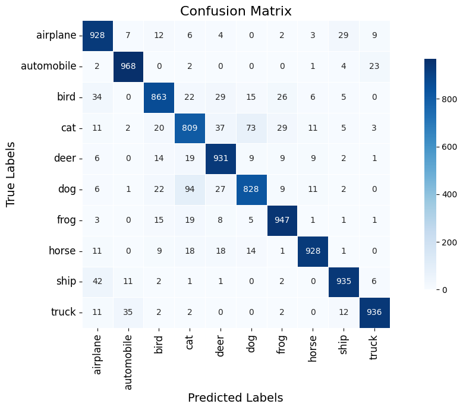

# 🧠 CIFAR-10 Classification with CNN

This repository contains a Convolutional Neural Network (CNN) built and trained to classify images from the [CIFAR-10 dataset](https://www.cs.toronto.edu/~kriz/cifar.html), which includes 60,000 32×32 color images in 10 classes.

---

## 📁 Project Structure

```

├── CIFAR-10.ipynb
├── Models/
├── Images/

````

---

## 📦 Installation

Make sure you have Python 3.7+ and install the required dependencies:

```bash
pip install torch torchvision matplotlib scikit-learn tqdm
````

---

## 🚀 Training

Run the notebook `CIFAR-10.ipynb` to train and evaluate the model. The training includes:

* CNN-based architecture
* CrossEntropy loss
* Optimizer (e.g. AdamW)
* Evaluation metrics: Accuracy, F1 Score
* Model checkpoint saving

---

## 📈 Results

### 🔁 Training Summary

Sample metrics during training:


| Epoch | Train Loss | Val Loss | Val F1  | Val Acc | Note                  |
|-------|------------|----------|---------|---------|-----------------------|
| 1     | 1.8903     | 1.6469   | 0.2801  | 0.3477  | Best model saved      |
| 2     | 1.5533     | 1.5789   | 0.4210  | 0.4507  | Best model saved      |
| 5     | 0.9774     | 0.8691   | 0.7007  | 0.7017  | Best model saved      |
| 9     | 0.7130     | 0.6175   | 0.7956  | 0.7941  | Best model saved      |
| 12    | 0.6146     | 0.5241   | 0.8261  | 0.8278  | Best model saved      |
| 19    | 0.5188     | 0.4811   | 0.8375  | 0.8389  | Best model saved      |
| 25    | 0.3349     | 0.4111   | 0.8714  | 0.8726  | Best model saved      |
| 29    | 0.3060     | 0.4085   | 0.8733  | 0.8743  | Best model saved      |
| 39    | 0.2807     | 0.3764   | 0.8804  | 0.8809  | Best model saved      |
| 42    | 0.1932     | 0.3549   | 0.8944  | 0.8943  | Best model saved      |
| 47    | 0.1671     | 0.3710   | 0.8953  | 0.8953  | Best model saved      |
| 61    | 0.1089     | 0.3699   | 0.9008  | 0.9013  | Best model saved      |
| 63    | 0.0929     | 0.3831   | 0.9026  | 0.9027  | Best model saved      |
| 65    | 0.0944     | 0.3663   | 0.9043  | 0.9042  | **Best F1 Overall**   |
| 80    | 0.0772     | 0.4301   | 0.8969  | 0.8968  | Early stopping        |


* Best model saved based on validation F1 Score.

---

## 🧪 Evaluation

### 📉 Confusion Matrices

<p align="center">  <br/> <em>Confusion Matrix - First Model</em> </p> <p align="center">  <br/> <em>Confusion Matrix - Improved Model</em> </p>

---

### 🖼️ Sample CIFAR-10 Images

<p align="center">
  
</p>

---

## 💾 Model Checkpoints

Trained models are stored in the `Models/` folder and can be loaded for inference or fine-tuning.

---

## ✍️ Author

[MReza Asgari](https://github.com/8Whoknow3)

